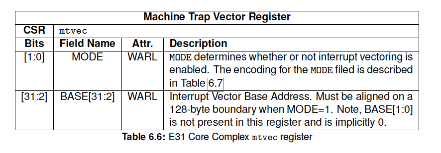

# 第6章 割り込み

この章ではRISC-Vアーキテクチャの割り込み概念がE31 Core Complexに
どのように適用されているかを説明します。RISC-V割り込みアーキテクチャに関する
情報については"RISC-V Instruction Set Manual, Volume II: Privileged Architecture, Version 1.10"[^2]を参照してください。

## 6.1 割り込みの概念

SiFive RISC-VコアIPの各hartはローカル（ソフトウェアとタイマーを含む）割り込みと
グローバル割り込みをサポートしています。

ローカル割り込みは固有の割り込み値で個々のhartに直接シグナルされます。このため、
どのhartが割り込みを処理するかを決める必要がなく、また、割り込みの原因を特定する
ためのメモリアクセスも不要になるので、割り込みのレイテンシが低くなります。ソフトウェア
割り込みとタイマー割り込みはコアローカル割り込み（CLINT）によって生成されるローカル
割り込みです。

グローバル割り込みはこれとは対照的にPLIC（Platform-Level Interrupt Controller）を
通してルーティングされます。PLICは外部割り込みを経由してシステム内のどのhartにも
割り込みを向けることができます。グローバル割り込みをhartから切り離すことで、PLICの
設計をプラットフォームに合わせることができ、割り込みの数や優先順位付け、ルーティング
方式など、幅広い属性を設定できます。

本章では、E31 Core Complexの割り込みアーキテクチャについて説明します。第7章では
グローバル割り込みアーキテクチャとPLICの設計について説明します。第8章ではコアローカル
割り込みについて説明します。

E31 Core Complexの割り込みアーキテクチャを図6.1に示します。

## 6.2 割り込みの入口と出口

RISC-Vのhartが割り込みを受けると以下のことが実行されます。

- `mstatus.MIE`の値が`mstatus.MPIE`にコピーされ、次に`mstatus.MIE`がクリアされ、
  割り込みが無効になる。
- 現在の`pc`が`mepc`レジスタにコピーされ、次に`pc`が`mtvec`の値に設定される。
  ベクトル割り込みが有効な場合、`pc`は`mtvec.BASE` + 4 * 例外コードに設定される。
- 割り込み前の特権モードが`mstatus.MPP`にエンコードされる。

この時点で制御は割り込みハンドラ内のソフトウェアに渡され、割り込みは無効化されます。
割り込みは`mstatus.MIE`を明示的に設定するか`MRET`命令を実行してハンドラを終了する
ことで再び有効にすることができます。`MRET`命令が実行されると以下のことが実行されます。

- 特権モードが`mstatus.MPP`にエンコードされていた値に設定される。
- `mstatus.MPIE`の値が`mstatus.MIE`にコピーされる。
- `pc`が`mepc`の値に設定される。

この時点で制御はソフトウェアに渡されます。

RISC-V割り込みの処理に関係するCSR (Control and Status Registers)については
6.3で説明します。

## 6.3 割り込み制御ステータスレジスタ

SiFive E31 Core Complex固有の割り込みCSRの実装を以下に説明します。RISC-Vの
割り込み動作の完全な説明とCSRのアクセス方法については"The RISC-V Instruction Set
Manual, Volume II: Privileged Architecture, Version 1.10" [^2]を参照してください。

### 6.3.1 Machine Status Register (`mstatus`)

`mstatus`レジスタは割り込みが有効になっているか否かなど、hartの現在の動作状態を追跡・
制御します。E31 Core Complexの割り込みに関連する`mstatus`フィールドの概要を表6.1に
示します（これは`mstatus`の完全な説明ではありません。mstatusには割り込みに関係のない
フィールドもあるからです）。`mstatus`の完全な説明については"The RISC-V Instruction Set Manual, Volume II: Privileged Architecture, Version 1.10" [^2]を参照してください。

割り込みは`mstatus`の`MIE`ビットを設定し、6.3.2節で説明する`mie`レジスタの所望の
割り込みを有効にすることで有効になります。

### 6.3.2 Machine Interrupt Enable Register (`mie`)

個々の割り込みは`mie`レジスタの大号するビットをセットすることにより有効にします。
E31 Core Complexの`mie`レジスタを表 6.2に示します。

### 6.3.3 Machine Interrupt Pending (`mip`)

Machine Interrupt Pending (`mip`)レジスタは現在どの割り込みが保留されているかを
示します。E31 Core Complexの`mip`レジスタを表 6.3に示します。

### 6.3.4 Machine Cause Register (`mcause`)

Machineモードでトラップが発生するとトラップの原因となったイベントを示すコードが
`mcause`に書き込まれます。トラップの原因となったイベントが割り込みである場合、
`mcause`の最上位ビットには**1**がセットされ、下位ビットは`mip`のビット位置と同じ
エンコーディングを使用して割り込み番号を示します。たとえば、Machine Timer割り込みが
発生すると`mcause`には`0x8000_0007`がセットされます。`mcause`は同期例外の原因を示す
ためにも使用されます。その場合、`mcause`の最上位ビットには**0**がセットされます。
割り込み例外コードの一覧については表6.5を参照してください。

### Machine Trap Vector (`mtvec`)

デフォルトではすべての割り込みは`mtvec`レジスタで定義されている1つのアドレスに
トラップされます。`mcause`を読み取り、それに応じて対応するか否かは割り込みハンドラ
次第です。RISC-VとE31 Core Complexはオプションで割り込みベクタを有効にする機能も
サポートしています。ベクタ機能を有効にすると`mie`で定義された割り込みがそれぞれ
固有の割り込みハンドラにトラップされるようになります。これによりすべてのローカル
割り込みが排他的ハンドラにトラップされるようになります。ベクタリングを有効にすると
すべてのグローバル割り込みは1つのグローバル割り込みベクタにトラップされます。

`mtvec`レジスタの`MODE`フィールドを**1**にセットするとベクタ割り込みが有効になります。

ベクタ割り込みが無効 (`mtvec.MODE=0`) の場合、すべての割り込みは`mtvec.BASE`アドレスに
トラップされます。ベクタ割り込みが有効 (`mtvec.MODE=1`) の場合、割り込みは`pc`を
`mtvec.BASE + 4 * 例外コード`にセットします。たとえば、マシンタイマー割り込みがかかると
`pc`は`mtvec.BASE + 0x1C`にセットされます。通常、トラップベクタテーブルには割り込み
固有のトラップハンドラに制御を移すためのジャンプ命令をセットします。

ベクタ割り込みモードでは`BASE`は128バイトアライメントでなければなりません。

すべてのマシン外部割り込み（グローバル割り込み）は、例外コード11にマップされます。
したがって、割り込みベクタが有効な場合、`pc`はグローバル割り込みのアドレス
`mtvec.BASE + 0x2C`にセットされます。E31 Core Complex割り込みの例外コード値については
表6.5を参照してください。

[^2]: A. Waterman and K. Asanovi´c, Eds., The RISC-V Instruction Set Manual Volume II: Privileged Architecture Version 1.10, May
2017. [Online]. Available: [https://riscv.org/specifications/](https://riscv.org/specifications/)
