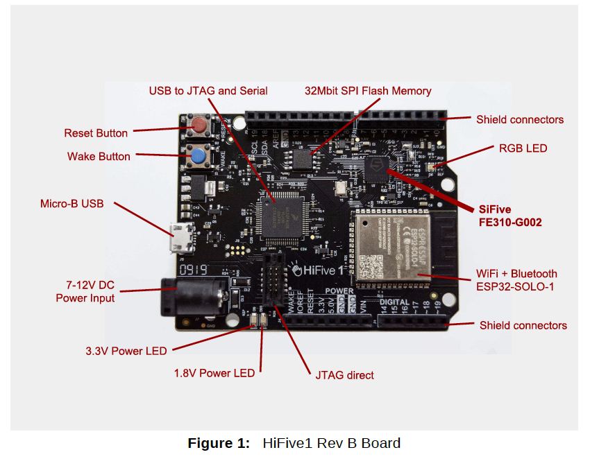

# 第1章 HiFive1 Rev Bダイアグラム

## 1.1 HiFive1 Rev Bコンポーネント

図1はHiFive1 Rev Bのこのドキュメントで説明されるコンポーネントを示しています。

## 1.2 HiFive1 Rev B回路図

HiFive1 Rev Bボードの回路図とユーザマニュアル、FE310-G002のデータシートは
SiFive社のウェブサイトにあります。

- [ドキュメント](https://www.sifive.com/documentation)
