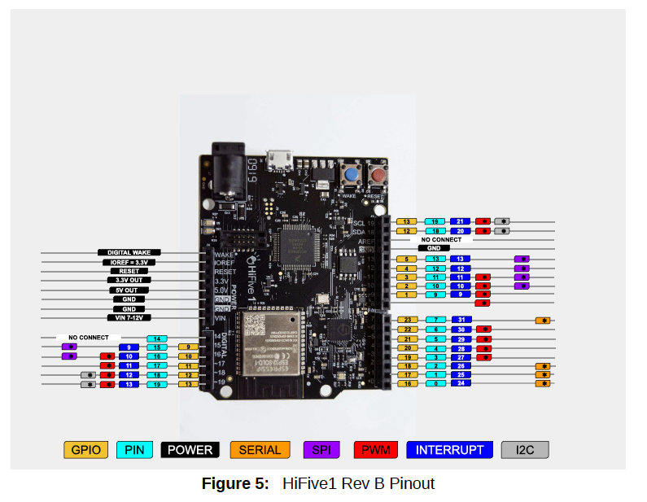

# 第10章 さらなる情報

## 10.1 デバッグ参考情報

- [https://gnu-mcu-eclipse.github.io/debug/jlink/install/](https://gnu-mcu-eclipse.github.io/debug/jlink/install/)
- [https://www.segger.com/downloads/jlink/UM08001](https://www.segger.com/downloads/jlink/UM08001)
- [https://www.gnu.org/software/gdb/documentation/](https://www.gnu.org/software/gdb/documentation/)
- [https://github.com/riscv/riscv-debug-spec](https://github.com/riscv/riscv-debug-spec)

## 10.2 高度な情報

- 追加情報、このガイドの最新版、サポートファイルは[https://www.sifive.com](https://www.sifive.com)
- 質問は[SiFive Forum](http://forums.sifive.com)
- RISC-V一般に関するより詳しい情報は[http://riscv.org](http://riscv.org)
- SiFiveの思想、考え方、ニュースは[https://www.sifive.com/blog/](https://www.sifive.com/blog/)
- [Webinar](https://info.sifive.com/risc-v-webinar)

