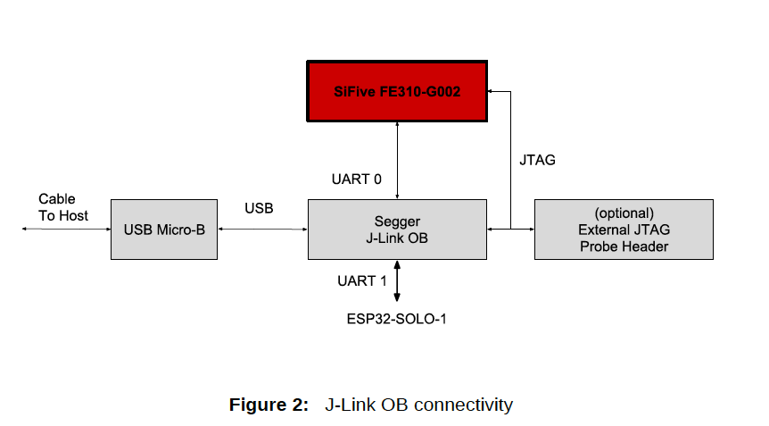
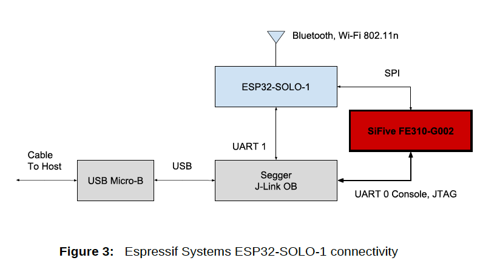

# 第3章 ハードウェアの機能

## 3.1 SiFive FE310-G002 SoC

HiFive1 Rev BはSiFive FE310-G002 System on Chip (SoC)の機能を評価できます。
このSiFive FE310-G002チップの詳細については以下を参照してください、

- [ドキュメント](https://www.sifive.com/documentation)

## 3.2 SPI Flash

HiFive1 Rev.BにはSPIインタフェースに接続された32Mbitのフラッシュメモリが
搭載されています。

- [ドキュメント](http://www.issi.com/WW/pdf/25LP-WP032D.pdf)

## 3.3 USB-JTAG/Serialポート

HiFive1 Rev.BにはUSBをJTAGにブリッジするSegger J-Link OBモジュールとFE310-G002
コンソール、FE310-G002 JTAG、ESP32-SOLO-1コンフィギュレーションに使用する2つの
シリアルポートが搭載されています。

[https://www.segger.com/products/debug-probes/j-link/models/j-link-ob/](https://www.segger.com/products/debug-probes/j-link/models/j-link-ob/)

- JTAGはFE310-G002のデバッグに使用されます
- Serial 0はFE310−G002コンソールに使用されます
- Serail 1はEspressif Systems ESP32-SOLO-1に使用されます

図2は、SiFive FE310-G002 SoCとJ-Link OB、HiFive1 Rev.Bのワイヤレスコネクティビティ間の
接続を示しています。

## 3.4 I/O 拡張コネクタ

HiFive1 Rev BはI/O拡張コネクタを備えており、そのピン配列はArduino®に由来しています。
（図5）のピン配列を参照してください。以下の点に注意してください。

- Arduino®アダプタの互換性は未確認です。
- アナログ信号I/O機能はなく、AREFピンは接続されていません。
- テクニカルサポートの依頼はSiFiveまでお願いします。

## 3.5 ワイヤレス

HiFive1 Rev.Bは無線規格Bluetooth、Bluetooth LE、Wi-Fi 802.11n用のEspressif Systems  
ESP32-SOLO-1モジュールを搭載しています。ESP32-SOLO-1モジュールにはSoC、フラッシュ
メモリ、精密ディスクリート部品、PCBアンテナが搭載されています。なお、ESP32-SOLO-1
モジュールのフラッシュメモリは、FE310-G002専用のSPIフラッシュとは別のフラッシュ
メモリです。シリアルインタフェースはEspressif Systems ESP32-SOLO-1のフラッシュメモリの
構成に使用されますが、ESP32-SOLO-1はesp32-atファームウェアが書き込まれた状態で
頒布されていることに注意してください：

- [https://github.com/espressif/esp32-at](https://github.com/espressif/esp32-at)

 ESP32-SOLO-1の無線機能は消費電力を抑えるため、ファームウェアによって起動時には
 無効化されています。

ドライバは2019年第2四半期後半に予定されています。

- [データシート](https://www.espressif.com/sites/default/files/documentation/esp32-solo-1_datasheet_en.pdf)

Espressif Systems ESP32-SOLO-1には複数の通信インターフェースがあります。
ワイヤレスインターフェース802.11nとBluetoothを備えています。また、有線SPIと
シリアルも持っています。SPIインタフェースはワイヤレスインタフェースとFE310-G002上で
動作するアプリケーションとの間の主要なデータパスとして使用されます。

図3はSiFive FE310-G002 SoCとワイヤレスコネクティビティ、HiFive1 Rev B上のJ-Link OB
との間の接続性を示しています。
