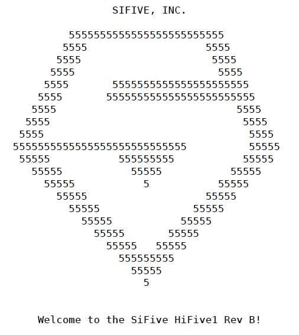
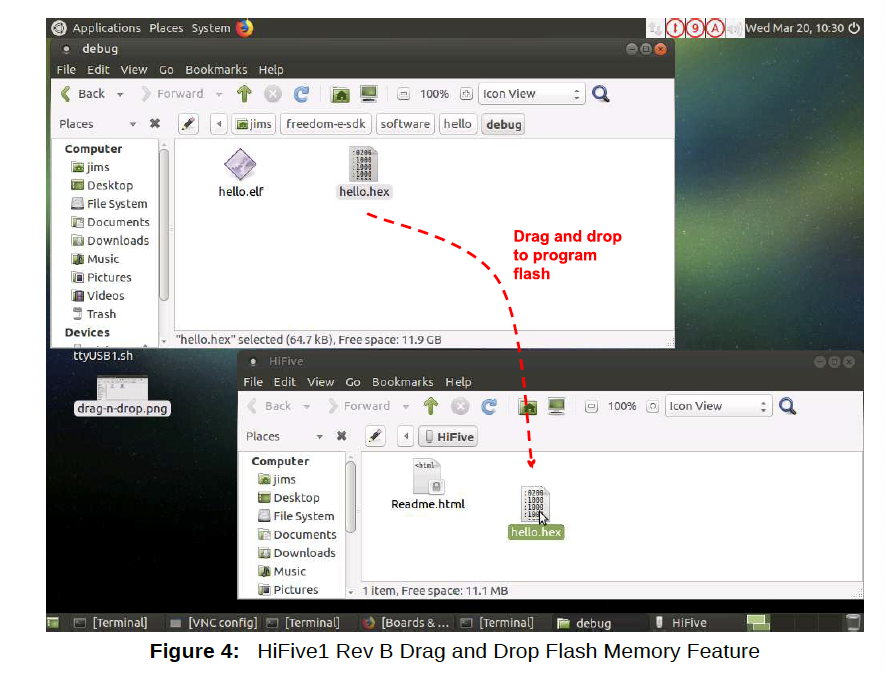

# 第6章 デバッガとコンソール

HiFive1 Rev.Bにはシンプルなブートローダとコンソールに出力し、RGB LEDを虹色パターンで
循環点滅させるデモソフトウェアプログラムがプログラムされています。

このデフォルトプログラムは新しいプログラムをボードにプログラムする際にSPIフラッシュに
上書きされますが、ブートローダのコードは変更されません。新しいプログラムの作成に
ついては第7章でより詳しく説明します。

コンソール、プログラム、デバッグの各機能はデバッガハードウェアとソフトウェアの
組み合わせで実装されています。このデバッグハードウェアとソフトウェアの組み合わせを
総称して「デバッガ」と呼びます。HiFive1 Rev BはSegger J-Link OBデバッガを使用して
います。Segger J-Link OBデバッガソリューションにはGDBサーバーソフトウェアが
含まれています。

J-Link OBデバッガにはUSBマスストレージ機能によるファイル転送機能があります。
ホストシステムに接続すると、HiFive1 Rev BはUSBマスストレージデバイスとして認識され、
グラフィカルなドラッグアンドドロップ操作によりプログラミングファイルをHiFive1 Rev Bに
簡単にフラッシュすることができます。

オプションの外部デバッガを使用することもできますがその構成は本書の範囲外です。

## 6.1 Segger J-Link OBデバッガの構成

必要なハードウェア接続はホストマシンとHiFive1 Rev.BをUSB Type Aオス-Micro-Bオス
ケーブルを接続するだけです。

Freedom Studio開発ダウンロードにはデバッガソフトウェアがバンドルされているので
ソフトウェアを個別に構成する必要はありません。Freedom StudioはJ-Link OBソフトウェアが
インストールされていることを検出するとこのインストールを使用し、そうでなければ、
バンドルされたソフトウェアを使用します。Freedom Studioを使用している場合は
この節は飛ばしてください。

Freedom E SDK開発環境ではHiFive1 Rev Bでプログラミングとデバッグを行うために
ホストマシンにJ-Link OBソフトウェアを別途インストールする必要があります。
インストールされるJ-Linkソフトウェアはホストマシンのオペレーティングシステムに
より異なります。

- ホストOSを選択し、[https://www.segger.com/downloads/jlink/#J-LinkSoftwareAndDocumentationPack](https://www.segger.com/downloads/jlink/#J-LinkSoftwareAndDocumentationPack)からドキュメントパックをダウンロードしてください。

### 6.1.1 Ubuntuへのインストール例

[https://www.segger.com/downloads/jlink/JLink_Linux_x86_64.deb](https://www.segger.com/downloads/jlink/JLink_Linux_x86_64.deb)からJLink_Linux_V644b_x86_64.debファイルを
ダウンロードしてください。

ダウンロードしたら次のコマンドを実行してソフトウェアをインストールしてください。

```bash
$ sudo dpkg -i ~/Downloads/JLink_Linux_V644b_x86_64.deb
```
実行可能ファイルへのシンボリックリンクが`/usr/bin`ディレクトリにインストールされます。

### 6.1.2 Windowsへのインストール例

[https://www.segger.com/downloads/jlink/JLink_Windows.exe](https://www.segger.com/downloads/jlink/JLink_Windows.exe)から
JLink_Windows.exeファイルをダウンロードして実行してください。

## 6.2 コンソールの構成

J-Link OBデバッガを構成した後、HiFive1 Rev BをUSB Type Aオス-Micro-Bオスケーブルで
ホストマシンに接続するとホストマシンからHiFive1 Rev Bコンソールにアクセスできるように
なります。

### 6.2.1 Ubuntuにおけるコンソール例

デバッガは2つのttyACMデバイスとUSBストレージデバイスをオペレーティングシステムに
提示します。オペレーティングシステムはこれらのデバイスに `/dev/ttyACM0`, 
`/dev/ttyACM1`, `/dev/sdb`のようなラベルを付けます。

Linux上で`GNU screen`などのターミナルエミュレータを使用して、ホストマシンから
HiFive1 Rev Bへのコンソール接続を開きます。

ターミナルは次のように設定してください。

| オプション | 値 |
|:-----------|:---|
| 速度 | 115200 |
| パリティ | None |
| データビット | 8 |
| ストップビット | 1 |
| ハードウェアフロー | None |

たとえば、Linux上でGNU Screenを次のように使用します。

```bash
$ sudo screen /dev/ttyACM0 115200
```

起動中のscreenセッションを"kill" (exit)するには`Ctrl-a k`を使用します。

ホストの設定によってはUSBポートにアクセスするためにドライバの追加やパーミションの
設定が必要かもしれません。

以下はUbuntuスタイルのLinuxを使用している場合にsudoパーミッションなしでUSBポート
ベースのコンソールにアクセスするために必要な手順の例です、

1. ボードのデバッグインタフェースを接続した状態で`lsusb`コマンドでHiFive1 Rev Bが
    表示されることを確認します。

    ```bash
    $ lsusb
    ...
    $ Bus XXX Device XXX: ID 1366:1051 SEGGER ...
    ```

2. udevルールを設定して`plugdev`グループがデバイスにアクセスできるようにします。

    ```bash
    $ sudo vi /etc/udev/rules.d/9-jlink.rules
    ```

    "LABEL="jlink_rules_end""の最終行のすぐ上に以下のように"SUBSYSTEM==..."行を
    追加します。

    ```bash
    SUBSYSTEM=="tty", ATTRS{idVendor}=="1366", ATTRS{idProduct}=="1051", MODE="664",GROUP="plugdev"
    LABEL="jlink_rules_end"
    ```

3. ボードがplugdevグループに属するシリアルデバイスとして表示されるかどうかを確認します。

    ```bash
    $ ls -l /dev/ttyACM*
      crw-rw-r-- 1 root plugdev 166, 0 May 15 15:57 /dev/ttyACM0
      crw-rw-r-- 1 root plugdev 166, 1 May 15 15:57 /dev/ttyACM1
    ```

    （他のシリアルデバイスや複数のボードを接続している場合はさらに多くのデバイスが
    表示されます）。コンソールUARTとのシリアル通信には常に2つのうち最初の番号
    （この例では/dev/ttyACM0）を選択します。

    ```bash
    $ ls -l /dev/ttyACM0
      crw-rw-r-- 1 root plugdev 166, 0 Mar 19 20:30 /dev/ttyACM0
    ```

4. デバイスへのアクセスにsudoが必要なくするためにユーザ名をplugdevグループに
    追加します。ユーザ名を知るには`whoami`コマンドを使います。

    ```bash
    $ whoami
      <user_name>
    $ sudo usermod -a -G plugdev <user_name>
    ```

5. ログアウトしてからログインし直し、plugdevグループのメンバーになっていることを
    確認してください。

    ```bash
    $ grups
      ... plugdev ...
    ```

これでsudo権限なしでシリアルコンソール（UART）とデバッグインタフェースにアクセスできる
はずです。

## 6.3 コンソール I/O

シリアルコンソールが正しくセットアップされている場合、工場出荷時にプログラムされた
HiFive1 Rev B のコンソールには以下のように表示されます。これはZephyrプログラムの
出力です。Zephyrの詳細については第8章を参照してください。プログラムをリセットして、
出力を見るには'Reset'ボタンを押す必要があります。SiFiveバナーが表示される前に
ワイヤレスモジュールの電源を切るコマンドの出力があることに注意してください。



## 6.4 ドラッグ&ドロップによる書き込み操作

HiFive1 Rev BはOS上ではFlushドライブとして表示されます。OSのGUIを使ってドラッグ&
ドロップ操作で`.hex`ファイルをHiFive1 Rev Bのフラッシュメモリに転送することができます。



図4はLinux GUIによる書き込み操作を示しています。
